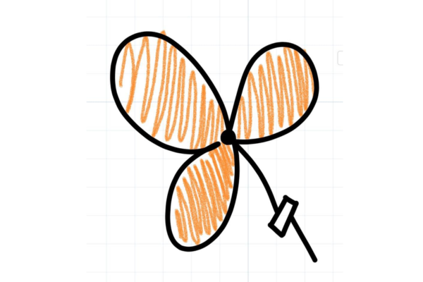
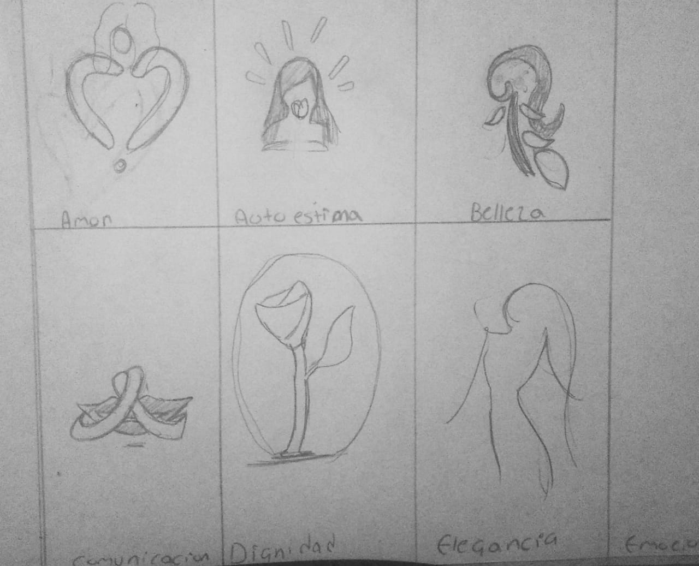
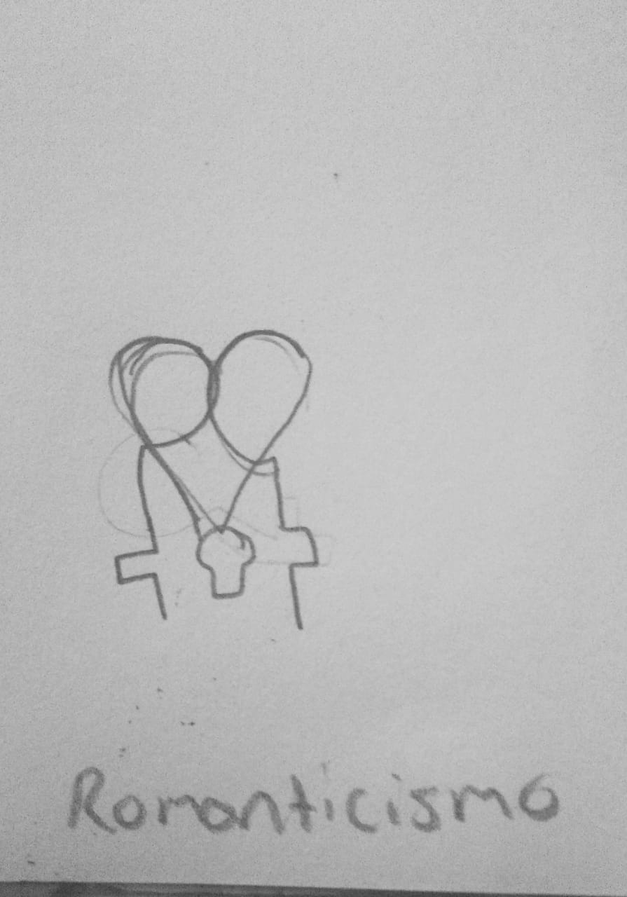

<!DOCTYPE html>
<html lang="es">
<head>
    <meta charset="UTF-8">
    <meta name="viewport" content="width=device-width, initial-scale=1.0">
    <title>Wiki La mujer y la cultura</title>
    
</head>
<body>

    <h1>La Mujer y su Expresión</h1>

    <!-- Barra de navegación -->
    

        <a href="#principal">Principal</a>
        <a href="#marco-referencial">Marco Referencial</a>
    

    

        <h2>Conceptos, Definiciones y Ilustraciones</h2>
        <ol>
            <li class="concept">
                <h3>Amor</h3>
                
Por amor entiendo que las mujeres, si algo que tanto pueden dar como quitar y recibir es amor, esto es algo que creo que probablemente sea una de las experiencias más profundas que se puede tener tanto en conexiones con otras personas y con objetos y animales, pero siento que en mujeres puede llegar a sentirse de diferente manera que en los hombres.

                
            </li>
            <li class="concept">
                <h3>Autoestima</h3>
                
La autoestima probablemente se divida en dos, o tienes mucha o tienes poca, pero si algo distingue a la mujer con la autoestima es que siempre serán seguras de ello y no dudarán en mostrar el valor que su autoestima llegue.

                
            </li>
            <li class="concept">
                <h3>Belleza</h3>
                
La belleza va más allá de lo físico ya que se puede considerar como un sello o un tipo de voto de confianza en sí mismo y la esencia que se tiene como persona en la apariencia que das a ver al mundo.

               
            </li>
            <li class="concept">
                <h3>Comunicación</h3>
                
Las mujeres sin duda alguna tienen un mejor sentido de comunicación ya que les permite tener la habilidad de expresarse emocionalmente o crear relaciones empáticas.

            </li>
            <li class="concept">
                <h3>Dignidad</h3>
                
Se puede definir como un auto reconocimiento de valor propio que se puede tener para mantener tu integridad y defender tus valores y expresar un trato justo en la vida.

                
            </li>
            <li class="concept">
                <h3>Elegancia</h3>
                
Esta expresa gracia y sofisticación tanto física como mentalmente mostrando una apariencia y un comportamiento de confianza y respeto.

                
            </li>
            <li class="concept">
                <h3>Emociones</h3>
                
Con las emociones es una expresión pura de sentimientos y experiencias que influyen en la perspectiva que se tiene del mundo, también en acciones, decisiones y relaciones.

                
            </li>
            <li class="concept">
                <h3>Empoderamiento</h3>
                
Este proceso se trata de reconocer y ejercer un poderío personal y alcanzar un máximo potencial y para aportar a la sociedad.

                
            </li>
            <li class="concept">
                <h3>Estilo de vida</h3>
                
Esto abarca tanto hábitos como decisiones que van desde carrera, metas, salud, valores y intereses que se tienen previstos como prioridades personales.

                
            </li>
            <li class="concept">
                <h3>Fortaleza</h3>
                
Es el comportamiento que le da la capacidad de enfrentar y superar desafíos mentales que se tienen manteniendo determinación para lograrlos y requiere de un equilibrio mental.

                
            </li>
            <li class="concept">
                <h3>Igualdad</h3>
                
Este principio tiene que asegurar que las mujeres puedan tener las mismas oportunidades y trato que los hombres quitando barreras de prejuicios y discriminación.

                
            </li>
            <li class="concept">
                <h3>Inteligencia</h3>
                
Una de las capacidades que permiten pensar de manera crítica y con racionalidad para resolver problemas, teniendo un equilibrio con lo emocional para poder funcionar en conjunto.

                
            </li>
            <li class="concept">
                <h3>Maternidad</h3>
                
Un término exclusivo de la mujer es la maternidad, el cual es un proceso que le brinda el instinto de criar, una responsabilidad biológica que se tiene y un compromiso de guiar, cuidar y apoyar a un hijo.

                
            </li>
            <li class="concept">
                <h3>Organización</h3>
                
En el contexto que estamos, esto se deriva de tener una gestión eficiente de tiempo, responsabilidad y tiempo para lograr metas satisfactoriamente.

                
            </li>
            <li class="concept">
                <h3>Romanticismo</h3>
                
Creo que para entender este concepto tiene que ver con la apreciación y expresión emocional, al igual que la creatividad para idealizar escenarios de sentimientos profundos.

                
            </li>
        </ol>
    

    

        <h2>Bocetos y Preliminares</h2>
           
       
       
       
       
       
       
       
       
       
       
    

            <!-- Otros conceptos con contenido similar -->
        </ol>
    

    <!-- Marco Referencial -->
    

        

            <h1>Investigación sobre Mujeres y Notas Olfativas</h1>
        </header>
        
        

           
        

        
        

            

                <h2>Reporte de Investigación: Mujeres Interesadas en Identificación de Notas Olfativas en Perfumería</h2>
                
                
La investigación se centra en el interés creciente de las mujeres por la educación olfativa en perfumería, especialmente en la identificación de notas y la comprensión de la composición de las fragancias. Hoy en día, las consumidoras no solo buscan un perfume que las represente, sino que también desean entender y analizar las notas que lo conforman.

                
                
Este interés por el aprendizaje profundo en perfumería responde a la necesidad de autenticidad y personalización, aspectos altamente valorados en un mercado donde las opciones masivas no siempre satisfacen el deseo de individualidad.

        
                
El objetivo principal de esta investigación es explorar y analizar el perfil, motivaciones y comportamientos de compra de mujeres interesadas en conocer más sobre las notas olfativas. Al mismo tiempo, se identifican oportunidades de mercado que permitan a las marcas ofrecer productos y servicios enfocados en esta educación olfativa, maximizando la conexión emocional que las consumidoras buscan al elegir una fragancia.

        
                
Para lograr estos objetivos, la investigación combinó entrevistas a profundidad con observaciones de campo en talleres de perfumería y eventos de lanzamiento de fragancias sostenibles, además de encuestas en línea para recolectar información sobre las preferencias y nivel de conocimiento de las participantes en el área de la perfumería.

                
                
Los resultados muestran que el perfil de las mujeres interesadas en la educación olfativa varía en edad, siendo comúnmente de 20 a 40 años, y tienen acceso a redes sociales, blogs y talleres como fuentes de información sobre perfumería.

                
                
Este grupo no solo valora la diferenciación en las fragancias, sino que también busca productos personalizados y de origen natural. Entre las principales motivaciones de este nicho destaca el interés en la educación olfativa como una forma de comprensión más profunda, que les permite reconocer las notas de salida, corazón y fondo de una fragancia.

                
                
La personalización también es clave, ya que muchas de estas mujeres desean fragancias que reflejen su estilo único y autenticidad. Además, la conexión emocional y sensorial es un aspecto importante, ya que perciben los perfumes como una forma de influir en su estado de ánimo y bienestar emocional, conectando con recuerdos y sentimientos específicos.

        
                
Dentro de las preferencias y comportamientos de compra se observa una inclinación hacia marcas que ofrecen una descripción detallada de las notas olfativas y utilizan ingredientes de origen natural. Las encuestas reflejan que una mayoría significativa, el 68% de las participantes, están dispuestas a pagar más por fragancias que incluyan información transparente y detallada sobre su composición. Esto evidencia un mercado potencial para productos diferenciados que respondan a este conocimiento en desarrollo.

        
                
A partir de estos hallazgos, se identifican varias oportunidades de mercado para atender este interés. Los talleres de educación olfativa, tanto presenciales como en línea, representan una alternativa para mujeres que buscan aprender a identificar las familias olfativas y comprender mejor el proceso creativo detrás de una fragancia.

        
                
Asimismo, ofrecer experiencias de personalización mediante consultorías olfativas podría responder a la demanda de fragancias únicas que reflejen la personalidad de cada consumidora.

        
                
Otra oportunidad consiste en la creación de kits de entrenamiento olfativo, que incluyan frascos con diferentes notas y familias para practicar el reconocimiento en casa, ideal para quienes desean profundizar su conocimiento en este ámbito.

        
                
También es posible desarrollar contenido educativo en línea, como videos, blogs y cursos que expliquen la estructura de las fragancias, permitiendo a las consumidoras aprender desde sus dispositivos.

        
                
La personalización en perfumería es un aspecto clave para este nicho. Las mujeres buscan fragancias que reflejen su personalidad y estilo únicos.

        
                
El interés por la educación olfativa va en aumento en el segmento femenino. Existe una percepción de las fragancias como un elemento de bienestar emocional.

        
                
Las mujeres están interesadas en entender los conceptos de notas de salida, corazón y fondo. La autenticidad y la exclusividad son factores valorados en la elección de fragancias.

        
                
El conocimiento de las familias olfativas influye en la preferencia de compra. Las consumidoras están dispuestas a pagar más por productos con ingredientes naturales.

        
                
Las redes sociales son una fuente primaria de información en perfumería para este nicho. Las consumidoras buscan diferenciarse de productos comerciales masivos.

        
                
Existe una demanda por talleres y cursos que profundicen en la identificación de notas. Las participantes prefieren marcas que brinden transparencia sobre ingredientes y procesos.

        
                
Este nicho se muestra interesado en marcas éticas y sostenibles. Las fragancias son percibidas como elementos que pueden influir en el estado de ánimo.

        
                
El aroma se asocia a menudo con la memoria y los recuerdos emocionales. Las consumidoras valoran fragancias que resalten su autenticidad y estilo personal.

        
                
La educación olfativa permite a las consumidoras tomar decisiones de compra más informadas. Los kits de entrenamiento olfativo representan una oportunidad de negocio.

        
                
La transparencia sobre la composición genera confianza en las marcas. Las consumidoras buscan experiencias sensoriales completas y personalizadas.

        
                
Existe interés en fragancias que se relacionen con prácticas de bienestar, como la aromaterapia. La mayoría de las consumidoras de este nicho son jóvenes y activas en redes sociales.

        
                
Las experiencias de compra personalizadas son cada vez más populares en este nicho. La creación de contenido educativo en línea es una estrategia valiosa para este mercado.

        
                
La industria de la perfumería puede beneficiarse al ofrecer experiencias interactivas. Este nicho aprecia los procesos artesanales en la creación de fragancias.

        
                
El uso de ingredientes naturales es un punto de diferenciación para atraer a estas consumidoras. Las consumidoras buscan experiencias significativas y memorables en perfumería.

        
                
Las fragancias de origen ético y sostenible tienen mayor valor para este público. La combinación de personalización y educación olfativa fideliza a las consumidoras.

        
                
Las consumidoras perciben la perfumería como una forma de expresión personal. El nicho ve las fragancias como una extensión de su identidad.

        
                
Existe interés en comprender la relación entre ingredientes y efectos emocionales. Las consumidoras buscan inspiración en redes para sus elecciones de fragancias.

        
                
La transparencia en el marketing es un factor de fidelidad en este nicho. Las consumidoras desean ser guiadas en el proceso creativo de las fragancias.

        
                
Existe una oportunidad en ofrecer experiencias sensoriales inmersivas en perfumería. Las consumidoras valoran la autenticidad y la conexión emocional con las marcas.

        
                
El conocimiento sobre fragancias les brinda a las consumidoras seguridad en sus decisiones. La interacción con perfumistas es una experiencia deseada en este nicho.

        
                
Los eventos exclusivos de lanzamiento atraen a estas consumidoras. La demanda de educación en perfumería se incrementa entre las mujeres jóvenes.

        
                
La experiencia sensorial es un diferenciador frente a productos de fragancia masivos. 
                    
Este nicho aprecia los detalles y la exclusividad en el diseño del perfume.

                    

                        Las consumidoras buscan fragancias que representen momentos específicos de su vida.
        

        
Las consumidoras buscan fragancias que representen momentos específicos de su vida.
        

        
La relación de las notas olfativas con la moda y el estilo genera interés en este nicho.
         
         
        <h1>Instrumento o Esquema de Preguntas para la Entrevista
        </h1>
        <i>Interés y Experiencia en Perfumería

        
¿Cómo describirías tu nivel actual de conocimiento sobre perfumería?
        

        
¿Qué te llevó a interesarte en aprender sobre las notas de los perfumes?
        

        <i> Preferencias y Hábitos de Compra
        </i>
        
¿Qué tipo de fragancias prefieres y por qué?
        

        
¿Sueles buscar información sobre las notas de un perfume antes de comprarlo?
        

        <i>Conocimiento y Percepción de Notas</i>
        
¿Qué tanto familiaridad tienes con términos como “notas de salida”, “corazón” y “fondo” en perfumería?
        

        
¿Podrías mencionar alguna nota específica que te atraiga o que prefieras evitar en los perfumes?
        

        <i>Motivaciones y Expectativas

        </i>
        
¿Qué esperas lograr al aprender a identificar notas de perfumería?
        

        
¿Hay algo específico que te gustaría aprender sobre la composición de los perfumes?
        

        <i>Influencia de las Fragancias en el Estado de Ánimo

        </i>
        
¿Cómo influye el aroma de un perfume en tu estado de ánimo o en tus decisiones de uso diario?
        

        <h1>Instrumento o Esquema de Preguntas para la Observación
        </h1>
        <i></i> Reacciones Sensoriales

        
¿Cómo reacciona la entrevistada al oler distintas notas (e.g., cítricas, florales, amaderadas)?
        

        
¿Muestra preferencia por alguna categoría de notas específica durante la sesión?
        

        <i>Identificación de Notas

        </i>
        
¿Qué tanto logra reconocer o diferenciar entre las distintas notas que se le presentan?
        

        
¿Asocia los aromas con algún recuerdo o estado de ánimo específico?
        

        <i> Expresiones y Lenguaje

        </i>
        
¿Qué palabras o descripciones usa para referirse a los diferentes aromas?
        

        
¿Expresa alguna dificultad al identificar o describir ciertos tipos de notas?
        

        <i>Nivel de Entusiasmo e Interés

        </i>
        
¿Muestra entusiasmo por el aprendizaje de las notas o parece más enfocada en ciertos tipos de fragancias?
        

            <!-- Botón para regresar al inicio -->
            <a href="#principal" class="boton-regresar">Volver al Inicio</a>
        

    

</body>
</html>

